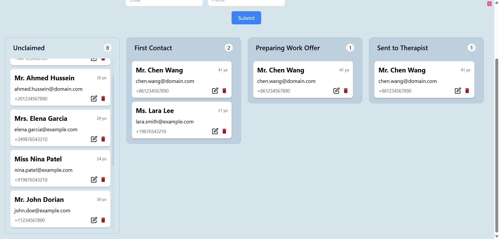

# Kanban Board Bookings

## Brief: Kanban Board Bookings

An online mental health clinic is building a new board to allow its operations team to keep track of new bookings. They have a basic form to enter the member's details onto the board:

- Name
- Title
- Age
- Email
- Mobile Number

The board has 4 columns:

- **Unclaimed**: new cases
- **First Contact**: operations team contact member
- **Preparing Work Offer**: searching for Therapist
- **Send to Therapist**: matched with Therapist

## Instructions to run the project:

1. Run npm install to install the necessary dependencies.
2. Run npm run dev to start the development server.
3. Run npm run server to start the backend mock api
4. Open your browser and navigate to http://localhost:5173.

## Final Design

This is the final design of the board:

